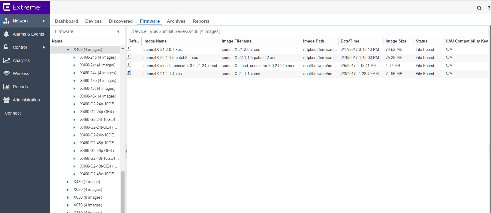
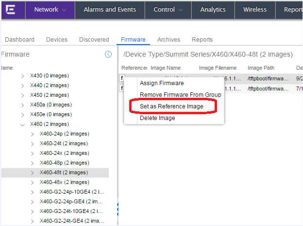

# EXOS CloudConnector Application
## _Attention: Install on ExtremeManagement Server only!_
This application enables ExtremeManagement to work with EXOS switches to provide a Zero Touch Provisioning Plus (ZTP+) exprience when installing 'just out of the box' ExtremeSwitches running EXOS.

__This firmware should be loaded to the ExtremeManagement server via the Network->Firmware page. Do not load Cloud Connector directly to the switch.__ 
Let Extreme Management do that for you by marking it as the Reference Image on the Firmware page.
_See the list of CloudConnector versions to match the EXOS version running on your ExtremeSwitching hardware._

### EXOS CloudConnector v3.0.34.54 for use with Extreme Management Center 8.x
The EXOS CloudConnector v3.0.34.54 application is used together with Extreme Management Center 8.x.

For Extreme Management Center 8.x, the firmware page is shown below:

Separate Cloud Connector versions are no longer necessary with EXOS CloudConnector v3.0.34.54. The EXOS CloudConnector v3.0.34.54 is compatible with all EXOS releases from EXOS 21.x and later. 
- [summitX-cloud_connector-3.0.34.54.xmod](summitX-cloud_connector-3.0.34.54.xmod?raw=true)
- [onie-cloud_connector-3.0.34.54.xmod](onie-cloud_connector-3.0.34.54.xmod?raw=true)

For a complete description of installation instructions and ExtremeManagement ZTP+ capabilities, see the ExtremeManagement 8.x documentation.

### EXOS CloudConnector v1.1.14.35 for use with Extreme Management Center 7.x
The EXOS CloudConnector v1.1.14.35 application is used together with Extreme Management Center 7.x.

For Extreme Management Center 7.x, the firmware page is shown below:

Select CloudConnector the version(s) that match the EXOS release running on your ExtremeSwitching devices and install them on the Extreme Management server. 
- [summitX-21.1-cloud_connector-1.1.14.35.xmod](summitX-21.1-cloud_connector-1.1.14.35.xmod?raw=true)
- [summitX-22.1-cloud_connector-1.1.14.35.xmod](summitX-22.1-cloud_connector-1.1.14.35.xmod?raw=true)
- [summitX-22.2-cloud_connector-1.1.14.35.xmod](summitX-22.2-cloud_connector-1.1.14.35.xmod?raw=true)
 
For a complete description of installation instructions and ExtremeManagement ZTP+ capabilities, see the ExtremeManagement 7.x documentation.

## License
Copyright© 2016, Extreme Networks
All rights reserved.

Redistribution and use in source and binary forms, with or without modification,
are permitted provided that the following conditions are met:

1. Redistributions of source code must retain the above copyright notice, this
list of conditions and the following disclaimer.

2. Redistributions in binary form must reproduce the above copyright notice,
this list of conditions and the following disclaimer in the documentation
and/or other materials provided with the distribution.

THIS SOFTWARE IS PROVIDED BY THE COPYRIGHT HOLDERS AND CONTRIBUTORS "AS IS" AND
ANY EXPRESS OR IMPLIED WARRANTIES, INCLUDING, BUT NOT LIMITED TO, THE IMPLIED
WARRANTIES OF MERCHANTABILITY AND FITNESS FOR A PARTICULAR PURPOSE ARE
DISCLAIMED. IN NO EVENT SHALL THE COPYRIGHT HOLDER OR CONTRIBUTORS BE LIABLE
FOR ANY DIRECT, INDIRECT, INCIDENTAL, SPECIAL, EXEMPLARY, OR CONSEQUENTIAL
DAMAGES (INCLUDING, BUT NOT LIMITED TO, PROCUREMENT OF SUBSTITUTE GOODS OR
SERVICES; LOSS OF USE, DATA, OR PROFITS; OR BUSINESS INTERRUPTION) HOWEVER
CAUSED AND ON ANY THEORY OF LIABILITY, WHETHER IN CONTRACT, STRICT LIABILITY,
OR TORT (INCLUDING NEGLIGENCE OR OTHERWISE) ARISING IN ANY WAY OUT OF THE USE
OF THIS SOFTWARE, EVEN IF ADVISED OF THE POSSIBILITY OF SUCH DAMAGE.

## Support
The software is provided as is and Extreme Networks has no obligation to provide
maintenance, support, updates, enhancements or modifications.
Any support provided by Extreme Networks is at its sole discretion.

Issues and/or bug fixes may be reported on [The Hub](https://community.extremenetworks.com/extreme).

