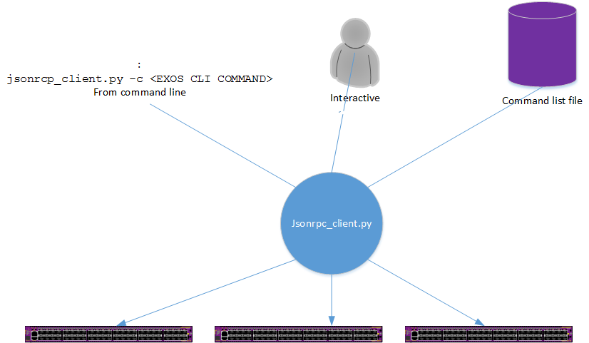
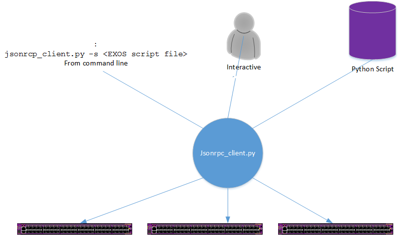

# JSONRPC EXOS Interface
## Description
EXOS 21.1 and later provides a JSONRPC interface for management communication with EXOS switches.
(see http://documentation.extremenetworks.com/app_notes/MMI/121152_MMI_Application_Release_Notes.pdf)


The sample `jsonrpc_client.py` script, available here, provides an example server application which uses the EXOS JSONRPC interface as well as being a useful tool on its own.

The `jsonrpc.py` class module contains the access methods for different EXOS JSONRPC methods.

## `jsonrpc.py`
The file `jsonrpc.py` is a python class module that may be imported into your python applications. It encapsulates the JSONRPC communications with EXOS switches for you so you may focus on solving your business needs.

```
from jsonrcp import JsonRPC
```


The JsonRPC provides management methods for:
* JsonRPC.cli()
    
    Send configuration or show CLI commands to switch(es). 	For show commands, the data strucutures  used to create the display are returned. No Screen scraping is required. The data stuctures may be directly used in your Python application.
    
* JsonRPC.runscript()
	
	Remotely run a script on switch(es) without downloading them first. the runscript JSONRPC method will transer the script from your server, run it and return the results.
    
    
* JsonRPC.python()

	This method is used for remotely running python applications that use
    the published EXOS python api. The JSONRPC constuction is similar to
    the 'runscript' method, but the python application has a wider selection
    of EXOS API calls available for a more advanced application.
    (see http://documentation.extremenetworks.com/python/)

## `jsonrcp_client.py`
The `jsonrcp_client.py` example application is also a used tool on its own.

**CLI**
* run a single CLI command across multiple switches
* run a list of CLI commands provided in a file across multiple switches
* interactively prompt for CLI commands and send each command to multiple switches



**Script**
* run a single script across multiple switches
* interactively prompt for a script file name and arguments then send each script to multiple switches



**Usage**
```
jsonrpc_client.py -h
```
```
usage: jsonrpc_client [-h] [-u USERNAME] [-p PASSWORD]
                      [-i [IPADDRESS [IPADDRESS ...]]] [-c] [-s]
                      [cli [cli ...]] [script [script ...]]

optional arguments:
  -h, --help            show this help message and exit
  -u USERNAME           Login username for the remote system
  -p PASSWORD           Login password for the remote system
  -i [IPADDRESS [IPADDRESS ...]]
                        IP address(s) of remote systems or <filename>
                        containing IP addresses

CLI command options:
  -c                    Remote CLI command
  cli                   CLI command

Script options:
  -s                    Remote script
  script                Script and arguments
```

**``-u``**
Username used to login to all switches provided in the IP address list

**``-p``**
Password used to login to all switches provided in the IP address list

**``-i``**
Either a list of IP address or the name of a file containing the IP address of EXOS switches

**``-c``**
EXOS command line

* no cli - interactively prompt for CLI commands to send to remote switches
* CLI - a single EXOS CLI command specified on the command line to be sent to remote switches
* filename - the name of a file that contains EXOS CLI commands to be sent to remote switchtes


**``-s``**
EXOS scripts
* no script - interactively prompt for the name of script files to run on remote switches
* filename - file name of script file to be run on remote switches

**Example command lines**

Let jsonrpc_client.py prompt for information
```
jsonrpc_client.py
```
jsonrpc_client.py will prompt for
* action - cli or script
* username
* password
* ipaddress(es)
* cli command or script name/args, depending on action selected

Provide a list of IP addresses and a single CLI command
```
jsonrpc_client.py -u myname -p mypassword -i 10.10.10.1 10.10.10.2 -c create vlan 10-20
```

Provide a file with IP addresses, interactively prompt for CLI commands
```
jsonrpc_client.py -u myname -p mypassword -i ipaddrlist -c
```

Provide a file with IP addresses and a file containing CLI commands
```
jsonrpc_client.py -u myname -p mypassword -i ipaddrlist -c cmd_list
```

Run a script on a single IP address, prompt for the script name and args
```
jsonrpc_client.py -u myname -p mypassword -i 10.10.10.1 -s
```

Run a script on a single IP address
```
jsonrpc_client.py -u myname -p mypassword -i 10.10.10.1 -s exos_script.py
```

Run a script on the IP addresses contained in a file
```
jsonrpc_client.py -u myname -p mypassword -i ipaddrlist -s exos_script.py
```

**Example file with list of IP addresses**
```
10.68.65.80
10.68.65.81
10.68.61.81
```

**Example file with list of EXOS CLI commands**
```
create vlan 10-20
config vlan 10-20 add ports all tag
show vid
show ports vid
```
